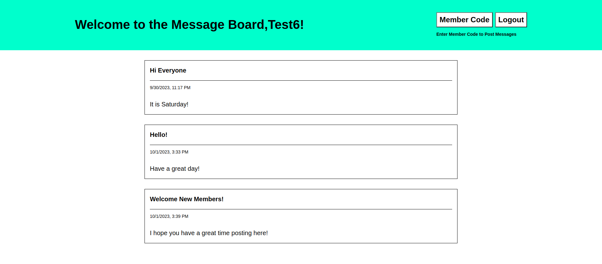

**Members Only Message Board**

I created a members only message board for users to post messages in. I used Express, Node.js, Pug, JSON, Bcrypt, Luxon, Mongoose, Passport, MongoDB, Nodemon, and CSS to create this project.

When users first log into the site they are on the non-user message board view. From this view anyone can see the messages posted, but not who wrote the message. The message board features the title, timestamp, and message the user posted. Non-users will also see a Sign-Up and Login button.

Homepage Non-User View:

After clicking the Login button users are routed to the Sign-Up Form. The Sign-Up Form requires the user to enter their first and last names. It also requires a unique username a password, the password must match the confirm password. Before the account can be created all information must be present.

Sign-Up Form Screen:

Once the account is created users are routed back to the message board screen. Users can click the login button and login after creating their account. Once logged in the user will see the same message board as the non-user until they become a member by entering the code word. The only difference is the user's name is now populated at the top.

Login Form Screen:

The user can become a member by entering the member code on this screen.

Member Code Screen:

Message Board User View:

Once the user is logged in they will see the message board screen with a few differences. The user will see the poster's name in the top right corner of each message. They will also see the Create Message and Admin Code buttons. 

Message Board Member Screen:

The member can become an admin by using the admin code on the admin screen. 

Admin Code Word Screen:

Once the member upgrades to being an admin they will be able to delete posts that any other member/admin posts. The delete button is in the bottom right of each message.

Each message board page has a logout button other than the first load in non-user view.

